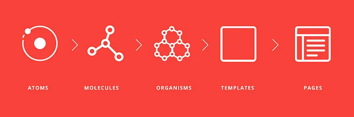

# Sumário

- [Running](#running)
- [Descrição](#descrição)
- [Estrutura de Pastas](#estrutura-de-pastas)
- [Funcionalidades Propostas](#funcionalidades-propostas)
- [Tecnologias Utilizadas](#tecnologias-utilizadas)
- [Dependências](#dependências)

# Running

- **Link do Repositório:** [https://github.com/IDG-TI/apontamento-front](https://github.com/IDG-TI/apontamento-front)

Para executar o projeto em um ambiente de desenvolvimento, siga os passos abaixo:

1. Navegue até a pasta raiz do projeto.
2. Execute os comandos:

```bash
npm install
npm run dev
```

# Descrição

**Equipamentos** é um sistema interno desenvolvido para a **IDG Engenharia e Consultoria**, com o objetivo de controlar o registro e gerenciamento de equipamentos utilizados nos projetos da empresa. De forma geral, o **Equipamentos** traz novamente funcionalidades já presentes no **equipamentos.info**, trazendo atualizações e melhorias em determinadas regras de negócios, bem como um visual atualizado e a utilização de tecnologias modernas.

# Estrutura de Pastas

A estrutura de pastas da aplicação **Equipamentos** segue o padrão **Atomic Design**, que organiza os componentes de uma aplicação **React.js** em diferentes níveis de abstração, conforme a complexidade dos componentes:

- **Átomos:** Componentes básicos e indivisíveis, como botões, inputs, labels, etc.
- **Moléculas:** Componentes compostos por átomos, como formulários e modais.
- **Organismos:** Componentes mais complexos, formados por moléculas e átomos, que representam seções da aplicação.
- **Páginas:** Representam as páginas da aplicação, compostas por organismos, moléculas e átomos. Em aplicações **SPA (Single Page Application)**, as páginas são carregadas dinamicamente, sem a necessidade de recarregar toda a aplicação.

Abaixo, a estrutura de diretórios detalhada da aplicação:

```
- components/                # Componentes da aplicação
    - atoms/                 # Componentes atômicos, nível mais básico
    - molecules/             # Componentes moleculares, compostos por átomos
        - modal/             # Componentes modais da aplicação
    - organisms/             # Componentes orgânicos, compostos por moléculas e átomos
    - pages/                 # Componentes de nível de página, maior nível hierárquico
    - func/                  # Funções reutilizáveis

- cypress/                   # Testes de integração E2E
- hooks/                     # Hooks customizados
- infra/                     # Arquivos de deployment e serviços
- public/                    # Arquivos públicos (imagens, SVG, ícones)
- src/                       # Diretório principal da aplicação
    - app/                   # Arquivos raiz da aplicação
    - assets/                # Arquivos de assets (ícones, imagens)
    - pages/                 # Rotas da aplicação
        - api/               # APIs internas para chamadas server-side no Next.js
    - styles/                # Módulos CSS
```



# Funcionalidades Propostas

O sistema **Equipamentos** foi desenvolvido para a **IDG Engenharia e Consultoria** com o objetivo de aprimorar o controle e gestão dos equipamentos utilizados nos projetos da empresa. As principais funcionalidades incluem:

**Cadastro e Gerenciamento de Equipamentos**: O sistema permite que os usuários registrem novos equipamentos, incluindo informações detalhadas como identificação, tipo, data de aquisição, estado atual (se está ativo ou inativo), responsável e a seção em que o equipamento está localizado. Além disso, é possível consultar e filtrar os equipamentos com base em critérios como tipo e responsável, permitindo uma gestão mais eficiente.

**Controle de Manutenção e Calibração**: Uma das funcionalidades mais importantes do sistema é a capacidade de registrar manutenções e calibrações dos equipamentos. Os usuários podem adicionar informações como data da última manutenção, próxima calibração prevista, e detalhes do serviço, como fornecedor e o responsável. O sistema também envia notificações automáticas para alertar os responsáveis quando a data de manutenção ou calibração estiver próxima de expirar.

**Gestão de Empréstimos de Equipamentos**: O sistema possibilita o controle dos empréstimos de equipamentos, registrando a data de empréstimo, data prevista de devolução, quem pegou o equipamento e quem autorizou o empréstimo. Para garantir uma operação tranquila, notificações automáticas são enviadas quando o prazo de devolução estiver próximo ou for ultrapassado.

**Descarte e Sucata**: Caso um equipamento não esteja mais em uso, o sistema permite marcar esses itens como sucateados, tornando-os inativos na base de dados. Além disso, é possível registrar o motivo e a data de descarte, garantindo um histórico completo de cada equipamento ao longo do seu ciclo de vida.

**Relatórios Detalhados**: Para apoiar a tomada de decisões e facilitar a gestão, o sistema gera relatórios detalhados sobre o status dos equipamentos, manutenções realizadas, empréstimos e descartes. Esses relatórios podem ser exportados em formatos como PDF ou Excel, permitindo que os dados sejam facilmente compartilhados e analisados.

**Notificações Personalizadas**: O sistema é configurado para enviar notificações personalizadas ao usuário Recepção sobre eventos importantes, como o vencimento de calibrações, a necessidade de manutenção, e atrasos na devolução de equipamentos, garantindo que nenhuma atividade crítica passe despercebida.

**Logout Seguro**: O sistema oferece uma opção de logout seguro, garantindo que, ao finalizar a sessão, o usuário seja redirecionado para a tela de login.

# Tecnologias Utilizadas

A aplicação foi desenvolvida utilizando as seguintes tecnologias:

- **[HTML5](https://developer.mozilla.org/pt-BR/docs/Web/HTML/HTML5):** Estruturação de conteúdo.
- **[CSS3](https://developer.mozilla.org/pt-BR/docs/Web/CSS):** Estilização de componentes.
- **[JavaScript](https://developer.mozilla.org/pt-BR/docs/Web/JavaScript):** Lógica de programação do frontend.
- **[Node.js](https://nodejs.org/en/):** Ambiente de execução para JavaScript no backend.
- **[TypeScript](https://www.typescriptlang.org/):** Superset de JavaScript com tipagem estática.
- **[React](https://pt-br.reactjs.org/) 18:** Biblioteca para construção de interfaces de usuário.
- **[Next.js](https://nextjs.org/) 14:** Framework React para desenvolvimento de aplicações web com renderização do lado do servidor (SSR).

# Dependências

Abaixo estão listadas as principais dependências utilizadas no projeto:

- **[React Toastify](https://fkhadra.github.io/react-toastify/introduction/):** Biblioteca para notificações toast no React.
- **[Tanstack Table](https://tanstack.com/table/v8):** Biblioteca para criação e gerenciamento de tabelas.
- **[Cypress](https://www.cypress.io/):** Framework para testes E2E.
- **[Cypress-dotenv](https://www.npmjs.com/package/cypress-dotenv):** Plugin para uso de variáveis de ambiente no Cypress.
- **[Cypress-RealEvents](https://www.npmjs.com/package/cypress-real-events):** Plugin para simulação de eventos reais no Cypress.
- **[Cookies](https://www.npmjs.com/package/cookies):** Manipulação de cookies no Node.js.
- **[Nookies](https://www.npmjs.com/package/nookies):** Biblioteca para manipulação de cookies em aplicações Next.js.
- **[Recharts](https://recharts.org/en-US/):** Biblioteca de gráficos para React.

---
